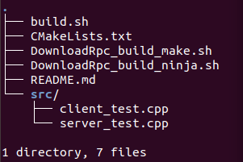

# use_opensource_rpclib
Construct a rpc  project based on https://github.com/rpclib/rpclib.  http://rpclib.net/cookbook/.

## code

## How to build and run on linux:

### step1:

bash DownloadRpc_build_make.sh or  DownloadRpc_build_ninja.sh

Downdload source code form github and build it with make or ninja system. After this, the rpclib and header files can be found in rpc_install dir.

### step2:

bash build.sh

Build a simple client app and a simple server app. They can communicate with each other by rpclib. After this, the executable files can be found in /my_install/my_bin, that's client_test and server_test.

Start server_test, then start client_test.

